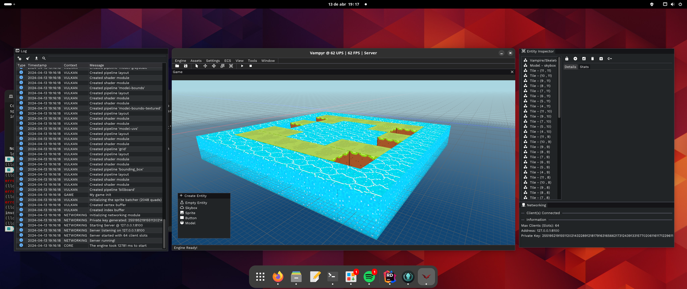

# Porting to Linux

In the last couple of days, I took an effort to port the engine to the Linux platform. This is not needed *per se* because most of today's games are run in Windows by default, but is nice to be able to run the engine in all the possible platforms out there. It's also a nice challenge to overcome.

<!-- more -->

Nonetheless, the real reason why I ported the engine to Linux is to, in the future, run games optimized for *Steam Deck*.

Yes, Steam Deck runs Windows games out-of-the box (with *Wine*), but it could be way easier to debug the engine/games if the engine/game runs on linux natively.

That's all folks!